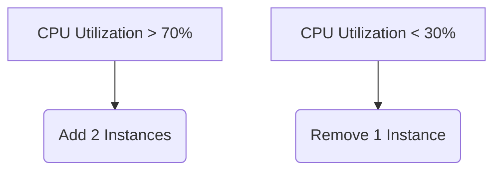

## Load Balancing

### Problem Statement
- Running an application on a single server leads to:
    - Increased server burden
    - Delayed request processing
    - Potential server crashes under heavy load

### Solution: Load Balancing
- Distributes incoming requests across multiple servers
- Improves performance and fault tolerance
- Supported natively in Spring Cloud via **Eureka + Ribbon**

---

### Load Balancing Example with Spring Cloud

**1. Start Multiple Instances of Welcome Service**  
Run the same application on different ports:
```bash
# Instance 1 (Port 8081)
java -jar welcome-service.jar --server.port=8081

# Instance 2 (Port 8082)
java -jar welcome-service.jar --server.port=8082
```

**2. Verify in Eureka Dashboard**  
Both instances will appear under "WELCOME-SERVICE":  


**3. API Gateway Configuration**  
The gateway automatically load balances using `lb://SERVICE-ID`:
```yml
spring:
  cloud:
    gateway:
      routes:
        - id: welcome-service
          uri: lb://WELCOME-SERVICE # Load balanced URI
          predicates:
            - Path=/api/welcome/**
```

**4. Test Load Balancing**  
Make multiple requests to the gateway endpoint:
```bash
curl http://localhost:8080/api/welcome
```
Requests will be distributed between instances (round-robin by default).

**5. Feign Client Load Balancing**  
Add `@LoadBalanced` to your Feign client:
```java
@FeignClient(name = "WELCOME-SERVICE")
public interface WelcomeClient {
    @GetMapping("/welcome")
    String getWelcomeMessage();
}
```

---

## Scaling

### Types of Scaling
1. **Vertical Scaling**
    - Increase resources (CPU, RAM) of existing servers
    - Limited by hardware capacity
    - Example: Upgrade from 4GB RAM → 16GB RAM

2. **Horizontal Scaling**
    - Add more servers to distribute load
    - Achieved through load balancing
    - Example: Run 5 instances of a service

### Scaling Strategies
| Action      | Description                                  | Use Case                     |
|-------------|----------------------------------------------|------------------------------|
| **Scale Up** | Add more servers during high traffic         | Black Friday sales           |
| **Scale Down**| Remove servers when traffic reduces         | Regular business hours       |

---

### Auto-Scaling in Cloud Platforms
Cloud providers (AWS, Azure, GCP) offer automatic scaling:


**Example AWS Auto Scaling Configuration**
```json
{
  "AutoScalingGroupName": "welcome-service-asg",
  "MinSize": 2,
  "MaxSize": 5,
  "TargetCPUUtilization": 60,
  "ScaleOutCooldown": 300,
  "ScaleInCooldown": 300
}
```

---

## Project Components
1. **Eureka Server**: Service discovery (port 8761)
2. **Spring Boot Admin**: Monitoring (port 9090)
3. **Zipkin**: Distributed tracing (port 9411)
4. **Welcome Service**: Core API (ports 8081/8082)
5. **API Gateway**: Routing & Load Balancing (port 8080)

---

## Verification Steps

1. **Check Load Balancing**
   ```bash
   # Run 10 requests to see distribution
   for i in {1..10}; do curl http://localhost:8080/api/welcome; done
   ```
   Observe logs from different instances.

2. **Monitor Auto-Scaling** (Cloud Example)  
   

3. **View Scaling History**
   ```bash
   # Cloud CLI example (AWS)
   aws autoscaling describe-scaling-activities --auto-scaling-group-name welcome-service-asg
   ```

---

> **Note**: For local testing, use multiple service instances with different ports. In production, use containerization (Docker/Kubernetes) or cloud platforms for effective scaling.